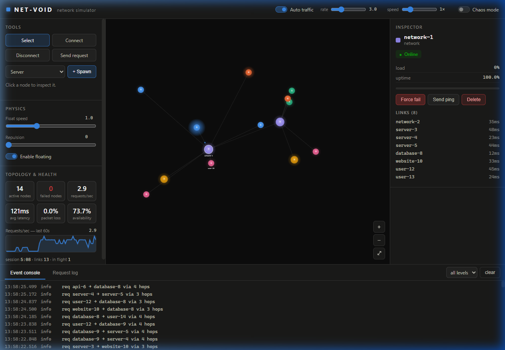
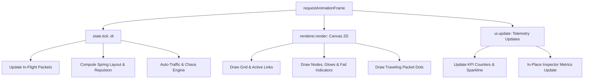

<div align="center">

# 🌐 NET-VOID

### Real-Time Interactive Network Simulator & Topology Visualizer

[](LICENSE)
[](https://developer.mozilla.org/en-US/docs/Web/JavaScript)
[](https://developer.mozilla.org/en-US/docs/Web/API/Canvas_API)
[](package.json)
[](CONTRIBUTING.md)

<p align="center">
  <b>NET-VOID</b> is an ultra-fast, zero-dependency browser-based network simulation platform designed to visualize, model, and stress-test computer networks, packet routing algorithms, and distributed systems topology in real time.
</p>

<p align="center">
  <a href="#-features">Features</a> •
  <a href="#-preview">Preview</a> •
  <a href="#-quick-start">Quick Start</a> •
  <a href="#-architecture">Architecture</a> •
  <a href="#-controls--interactions">Controls</a> •
  <a href="#-chaos-engineering">Chaos Mode</a> •
  <a href="#-license">License</a>
</p>

---

</div>

## 📸 Preview

<div align="center">
  
</div>

---

## ✨ Features

### 🗺️ Dynamic Network Topology & Node Spawning
* **Multi-Tier Node Types**: Model heterogeneous networks with dedicated node classes:
  * 🖥️ **Servers** (`#3987e5`): Compute backends handling business logic.
  * 🌐 **Websites** (`#d95926`): Frontend access points facing incoming user traffic.
  * ⚡ **APIs** (`#199e70`): REST/GraphQL microservice endpoints.
  * 🗄️ **Databases** (`#c98500`): State stores and persistent backends.
  * 👤 **Users** (`#d55181`): Client traffic generators triggering requests.
  * 🔀 **Networks** (`#9085e9`): High-bandwidth routing hubs and switch nodes.
* **Auto-Link Intelligence**: Newly spawned nodes automatically link to the nearest network backbone to form cohesive routing domains.

### 🧠 A* Graph Routing & Packet Simulation
* **Shortest-Path Graph Search**: Uses an optimized **A\* pathfinding algorithm** incorporating spatial Euclidean distance heuristics and dynamic link latency costs.
* **Realistic Packet Physics**: Visual packet transmission with latency calculations based on distance and simulated link conditions.
* **Automatic Cascading**: Successful requests trigger downstream sub-queries (e.g. Website ➔ API ➔ Database), simulating authentic microservice traffic.

### 🔬 Interactive Node Inspector & Lifecycle Management
* **Real-Time Telemetry**: Inspect individual node loads, uptimes, active links, and latency metrics without UI freezing.
* **Force Fail**: Manually inject node failures to evaluate network fault-tolerance and failover behavior.
* **Hot Restart**: Trigger simulated 3-second node recovery cycles (`restarting ➔ online`).
* **Targeted Ping**: Dispatch on-demand test packets toward reachable destinations with hop-by-hop verification.
* **Dynamic Node Deletion**: Remove topology nodes with automatic edge unlinking and in-flight request cleanup.

### 🌪️ Built-in Chaos Engineering
* **Latency Spikes**: Injects stochastic delays across communication channels.
* **Packet Loss**: Simulates probabilistic dropped packets and unreachable gateways.
* **Node Overload & Crash**: Forces traffic spikes that degrade node health and cause brownouts or crash-stop failures.

### 📊 Comprehensive Telemetry & Observability
* **Real-time Sparkline**: 60-second rolling requests-per-second (RPS) velocity chart.
* **Live Health KPIs**: Tracks active vs. failed nodes, average latency (ms), packet loss percentage, and availability uptime.
* **Dual Monitoring Pager**:
  * **Event Console**: Filterable system logs (`info`, `ok`, `warn`, `error`, `chaos`).
  * **Request Log**: Granular telemetry table detailing source, destination, hop route, round-trip latency, and final status (`ok`, `in-flight`, `dropped`, `unroutable`, `timeout`).

---

## 🚀 Quick Start

NET-VOID runs completely client-side in any modern web browser with **zero installation** or build steps required.

### Option 1: Python HTTP Server (Recommended)
```bash
# Clone the repository
git clone https://github.com/rohit357/NET-VOID.git
cd NET-VOID

# Serve locally
python -m http.server 8080
```
Open **[http://localhost:8080](http://localhost:8080)** in your browser.

### Option 2: Node.js / NPX
```bash
# Using npx serve
npx serve .
```

### Option 3: Direct File Execution
You can also launch `index.html` directly in a browser supporting ES modules with local file access, or via VS Code Live Server.

---

## 🛠️ Architecture

NET-VOID is architected around a modular ES6 design pattern decoupled from external libraries or frameworks for maximum runtime performance and 60 FPS canvas rendering.

```
NET-VOID/
├── index.html          # Semantic HTML5 container, layout panels, and modal guide
├── css/
│   └── styles.css      # Dark-mode developer tool design system & responsive grid
├── js/
│   ├── main.js         # High-DPI canvas setup, module bootstrapping, and animation loop
│   ├── state.js        # Graph data structures, A* pathfinder, lifecycle, and telemetry
│   ├── renderer.js     # Canvas 2D rendering pipeline, camera pan/zoom, and spring physics
│   └── ui.js           # Stable DOM inspector, event delegation, tabs, and filters
└── assets/
    └── preview.png     # Interface screenshot for documentation
```

### Simulation Loop


---

## 🎮 Controls & Interactions

| Action | Tool / Shortcut | Description |
| :--- | :--- | :--- |
| **Inspect / Move** | `Select` tool (default) | Click any node to inspect in the sidebar. Drag nodes to reposition. |
| **Pan Canvas** | `Select` tool | Click and drag any empty canvas area to pan the camera. |
| **Zoom In / Out** | Mouse Wheel / `+` `-` | Smooth zoom focused towards your cursor position. |
| **Reset View** | `⤢` (Fit button) | Auto-centers and scales the camera to fit the entire network. |
| **Create Link** | `Connect` tool | Click source node, then destination node to establish a link. |
| **Remove Link** | `Disconnect` tool | Click any active link edge to remove communication between nodes. |
| **Send Request** | `Send request` tool | Click source node, then destination node to send a manual packet. |
| **Spawn Node** | `+ Spawn` button | Select a node type from dropdown and spawn it into the network. |

---

## 🌪️ Chaos Engineering

Activate **Chaos Mode** in the top bar to subject the network to unpredictable real-world operating conditions:

```javascript
// Chaos Event Probability Matrix
- Latency Spikes (25%): Injects 3000ms latency degradation on random links
- Packet Loss    (25%): Forces 15% - 40% packet drops along active channels
- Node Failure   (25%): Causes abrupt crash of an active service
- Sudden Load    (25%): Injects +40% - 80% load spikes triggering thermal protection
```

---

## ⚡ Performance & Optimization

* **High-DPI Display Support**: Automatically calculates window `devicePixelRatio` for sharp rendering on 4K and Retina screens.
* **Non-Destructive Inspector Updates**: Telemetry updates (CPU load, uptime, link latency) are applied directly to existing DOM nodes, avoiding DOM reflows and preserving button click states.
* **Memory-Managed Request Pools**: In-flight requests and logs are circular-buffered to prevent memory leakage during prolonged simulation sessions.

---

## 🤝 Contributing

Contributions make the open-source community an amazing place to learn, inspire, and create. Any contributions you make are **greatly appreciated**.

1. Fork the Project
2. Create your Feature Branch (`git checkout -b feature/AmazingFeature`)
3. Commit your Changes (`git commit -m 'Add some AmazingFeature'`)
4. Push to the Branch (`git push origin feature/AmazingFeature`)
5. Open a Pull Request

---

## 📄 License

Distributed under the **MIT License**. See `LICENSE` for more information.

---

<div align="center">
  <sub>Built with ❤️ for network engineers, distributed systems enthusiasts, and developers.</sub>
</div>
